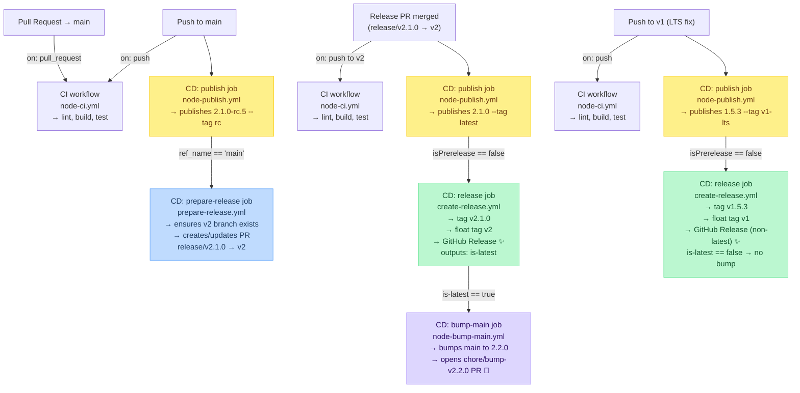

# workflows

Reusable GitHub Actions workflows for Node and .NET packages. Provides separate, composable workflows for CI checks, publishing, release PR preparation, and GitHub Release creation.

## Tags

| Tag              | Workflows                                                         |
| ---------------- | ----------------------------------------------------------------- |
| `node-libs-v1`   | `node-lib.yml` (deprecated — use v2 split workflows)              |
| `node-libs-v2`   | `node-ci.yml`, `node-publish.yml`                                 |
| `dotnet-libs-v1` | `dotnet-package.yml` (deprecated — use v2 split workflows)        |
| `dotnet-libs-v2` | `dotnet-ci.yml`, `dotnet-publish.yml`                             |
| `release-v1`     | `prepare-release.yml`, `create-release.yml`, `node-bump-main.yml` |

```bash
# move tag (shorthand)
TAG=<TAG> && git tag -f $TAG && git push origin $TAG -f
```

---

## Workflows

### `node-ci.yml` · `@node-libs-v2`

Runs lint, build, and test. No publish, no version logic. Use on PRs and pushes.

**Inputs**

| Input                  | Default        | Description                                            |
| ---------------------- | -------------- | ------------------------------------------------------ |
| `node-version-file`    | `package.json` | File containing the Node version spec                  |
| `package-manager`      | `npm`          | `npm` or `pnpm`                                        |
| `private-npm-registry` | —              | Private registry URL; configures auth when set         |
| `private-npm-scope`    | —              | Scope for private registry; auto-resolved when omitted |

**Secrets** `private-npm-auth-token`

---

### `node-publish.yml` · `@node-libs-v2`

Resolves the version via `version-builder-action`, bumps `package.json`, installs, builds, and publishes the package. Designed to run **after** `node-ci.yml` — does not repeat lint/test.

**Inputs**

| Input                  | Default                      | Description                                           |
| ---------------------- | ---------------------------- | ----------------------------------------------------- |
| `node-version-file`    | `package.json`               | File containing the Node version spec                 |
| `package-manager`      | `npm`                        | `npm` or `pnpm`                                       |
| `registry-url`         | `https://registry.npmjs.org` | NPM registry to publish to                            |
| `private-npm-registry` | —                            | Private registry URL                                  |
| `private-npm-scope`    | —                            | Scope for private registry                            |
| `preid-branches`       | _(action default)_           | Branch → preid mapping e.g. `main:rc,develop:dev`     |
| `force-preid`          | `false`                      | Force preid even if branch doesn't match              |
| `publish-command`      | `npm run release`            | Command used to publish                               |
| `version-replace`      | `0.0.0-PLACEHOLDER`          | Placeholder string to replace in source               |
| `version-replace-glob` | `src/version.ts`             | Glob of files to replace placeholder in; `""` to skip |

**Secrets** `private-npm-auth-token`

**Outputs**

| Output         | Example                    | Description                   |
| -------------- | -------------------------- | ----------------------------- |
| `version`      | `2.1.0-rc.5`               | Full published version        |
| `baseVersion`  | `2.1.0`                    | Version without preid         |
| `isPrerelease` | `true`                     | Whether this is a pre-release |
| `tag`          | `rc` / `latest` / `v1-lts` | NPM dist-tag used             |
| `majorVersion` | `2`                        | Major version number          |
| `minorVersion` | `1`                        | Minor version number          |
| `patchVersion` | `0`                        | Patch version number          |

---

### `prepare-release.yml` · `@release-v1`

After a pre-release publish on `main`, force-pushes the current HEAD to a `release/v{baseVersion}` branch, ensures the `v{major}` stable branch exists (creates it automatically on first use), and always creates (or updates) a PR from `release/v{baseVersion}` → `v{major}`. On first bootstrap, `v{major}` is created one commit behind the release branch so the PR has a real file diff — ensuring a squash merge onto `v{major}` always contains real changes and correctly triggers push-based workflows. Language-agnostic.

**Inputs**

| Input          | Required | Description                                              |
| -------------- | -------- | -------------------------------------------------------- |
| `base-version` | ✅        | e.g. `2.1.0`                                             |
| `title`        | —        | PR title override; defaults to `Release v{base-version}` |

**Secrets**

| Secret  | Required | Description                                                                                                                                                                                                                    |
| ------- | -------- | ------------------------------------------------------------------------------------------------------------------------------------------------------------------------------------------------------------------------------ |
| `token` | —        | GitHub token to use. Defaults to `GITHUB_TOKEN`. **Public repos** must supply a PAT or GitHub App token with the `workflow` scope — `GITHUB_TOKEN` cannot push branches containing `.github/workflows/` files on public repos. |

---

### `create-release.yml` · `@release-v1`

Creates the exact git tag (`v2.1.0`), force-updates the floating major tag (`v2`), and publishes a GitHub Release with auto-generated notes. Automatically determines whether to mark the release as `--latest` by comparing the major version against all existing tags. Language-agnostic — used by both Node and .NET publish flows.

**Inputs**

| Input      | Required | Default    | Description                                                                                                    |
| ---------- | -------- | ---------- | -------------------------------------------------------------------------------------------------------------- |
| `version`  | ✅        | —          | e.g. `2.1.0`                                                                                                   |
| `tag-tmpl` | —        | `v{major}` | Tag template; `{major}` is replaced with the major version number. e.g. `v{major}` → `v2`, `{major}.x` → `2.x` |

**Outputs**

| Output      | Example | Description                                                          |
| ----------- | ------- | -------------------------------------------------------------------- |
| `is-latest` | `true`  | Whether this major is the highest released. Used to guard bump-main. |

---

### `node-bump-main.yml` · `@release-v1`

After a stable release on the latest major, bumps the minor version in `package.json` on the default branch and opens a PR. Uses `npm version minor --no-git-tag-version` and commits with `[skip ci]` to avoid redundant CI runs on the bump branch and PR. Callers should guard with `create-release` output `is-latest == 'true'` so backport releases (e.g. `v1.x` while main is on `v2`) don't trigger a spurious bump.

**Inputs**

| Input              | Required | Default | Description                                         |
| ------------------ | -------- | ------- | --------------------------------------------------- |
| `released-version` | ✅        | —       | The just-released stable version e.g. `2.1.0`       |
| `default-branch`   | —        | `main`  | Branch to bump and target with the PR e.g. `master` |

---

### `dotnet-ci.yml` · `@dotnet-libs-v2`

Runs `dotnet restore`, `dotnet build`, and `dotnet test`. No publish.

**Inputs**

| Input                      | Default  | Description                                                                                                                                    |
| -------------------------- | -------- | ---------------------------------------------------------------------------------------------------------------------------------------------- |
| `dotnet-version`           | `10.0.x` | .NET SDK version                                                                                                                               |
| `solution-file`            | —        | Solution or project file to build. When omitted, auto-resolved from `package.json#dotnetBuildSln`, then blank.                                 |
| `private-nuget-env-prefix` | —        | Env var prefix for NuGet credentials (must match `NuGet.Config` `%{PREFIX}_USERNAME%` / `%{PREFIX}_TOKEN%`). When set, configures credentials. |

**Secrets**

| Secret                     | Description                                                      |
| -------------------------- | ---------------------------------------------------------------- |
| `private-nuget-username`   | Username for private NuGet registry. Defaults to `github.actor`. |
| `private-nuget-auth-token` | Auth token for private NuGet registry.                           |

---

### `dotnet-publish.yml` · `@dotnet-libs-v2`

Resolves the version via `version-builder-action`, builds, packs, and pushes NuGet packages.

**Inputs**

| Input                      | Default                               | Description                                                                                                                                    |
| -------------------------- | ------------------------------------- | ---------------------------------------------------------------------------------------------------------------------------------------------- |
| `dotnet-version`           | `10.0.x`                              | .NET SDK version                                                                                                                               |
| `source-url`               | `https://api.nuget.org/v3/index.json` | NuGet source URL passed to `setup-dotnet` for credential configuration.                                                                        |
| `source-name`              | —                                     | NuGet source name (from `NuGet.Config`) used for `dotnet nuget push -s`. Falls back to `source-url` when omitted.                              |
| `solution-file`            | —                                     | Solution or project file to build. When omitted, auto-resolved from `package.json#dotnetBuildSln`, then blank.                                 |
| `private-nuget-env-prefix` | —                                     | Env var prefix for NuGet credentials (must match `NuGet.Config` `%{PREFIX}_USERNAME%` / `%{PREFIX}_TOKEN%`). When set, configures credentials. |
| `preid-branches`           | _(action default)_                    | Branch → preid mapping e.g. `main:rc,develop:dev`                                                                                              |
| `force-preid`              | `false`                               | Force preid even if branch doesn't match                                                                                                       |

**Secrets**

| Secret                   | Description                                                                                                                         |
| ------------------------ | ----------------------------------------------------------------------------------------------------------------------------------- |
| `nuget-auth-token`       | Auth token for the NuGet publish source. Also used as `{PREFIX}_TOKEN` for private restore credentials. Defaults to `GITHUB_TOKEN`. |
| `private-nuget-username` | Username for private NuGet registry. Defaults to `github.actor`.                                                                    |

**Outputs** `version`, `baseVersion`, `isPrerelease`, `tag`, `majorVersion`

---

## Branch & Release Flow



---

## Usage Examples

### Node package (npm / pnpm)

> Minimal setup for a Node library published to a private registry using pnpm.

> **Public repo?** The `prepare-release` job must pass a PAT or GitHub App token with the `workflow` scope via `secrets: token`. Store it as a repository secret (e.g. `GH_PAT`) and add to the job:
> ```yaml
>   prepare-release:
>     ...
>     secrets:
>       token: ${{ secrets.GH_PAT }}
> ```
> Private repos work with the default `GITHUB_TOKEN` and no extra configuration.

**.github/workflows/ci.yml**
```yaml
name: CI

on:
  push:
    branches: [main, "v*", "workflow"]
    paths-ignore: ["**.md"]
  pull_request:
    branches: [main, "v*"]
    paths-ignore: ["**.md"]

permissions:
  contents: read

jobs:
  ci:
    name: node CI
    uses: sketch7/.github/.github/workflows/node-ci.yml@node-libs-v2
    with:
      package-manager: pnpm
      private-npm-registry: ${{ vars.MY_NPM_REGISTRY }}
    secrets:
      private-npm-auth-token: ${{ secrets.MY_NPM_TOKEN }}
```

**.github/workflows/cd.yml**
```yaml
name: CD

on:
  push:
    branches: [main, "v*", "workflow"]
    paths-ignore: ["**.md"]
  workflow_dispatch:
    inputs:
      publish:
        description: "Publish 🚀"
        type: boolean
        default: false
      force-prerelease:
        description: "Force Pre-release"
        type: boolean
        default: true

permissions:
  id-token: write
  contents: write
  packages: write
  pull-requests: write

jobs:
  publish:
    name: Publish
    if: |
      contains(fromJSON('["main", "workflow"]'), github.ref_name) ||
      startsWith(github.ref_name, 'v') ||
      github.event.inputs.publish == 'true'
    uses: sketch7/.github/.github/workflows/node-publish.yml@node-libs-v2
    with:
      package-manager: pnpm
      private-npm-registry: ${{ vars.MY_NPM_REGISTRY }}
      force-preid: ${{ github.event.inputs.force-prerelease == 'true' }}
      version-replace-glob: "" # set to "src/version.ts" if you embed the version
    secrets:
      private-npm-auth-token: ${{ secrets.MY_NPM_TOKEN }}

  prepare-release:
    name: Prepare Release
    needs: publish
    if: |
      needs.publish.result == 'success' &&
      github.event_name == 'push' &&
      github.ref_name == 'main'
    uses: sketch7/.github/.github/workflows/prepare-release.yml@release-v1
    with:
      base-version: ${{ needs.publish.outputs.baseVersion }}

  release:
    name: Release
    needs: publish
    if: |
      needs.publish.result == 'success' &&
      !fromJSON(needs.publish.outputs.isPrerelease)
    uses: sketch7/.github/.github/workflows/create-release.yml@release-v1
    with:
      version: ${{ needs.publish.outputs.version }}

  bump-main:
    name: Bump main
    needs: [publish, release]
    if: |
      needs.release.result == 'success' &&
      needs.release.outputs.is-latest == 'true' &&
      github.event_name == 'push'
    uses: sketch7/.github/.github/workflows/node-bump-main.yml@release-v1
    with:
      released-version: ${{ needs.publish.outputs.version }}
```

---

### .NET / NuGet package

> Minimal setup for a .NET library published to NuGet.org. For a **private registry** (e.g. GitHub Packages), set `private-nuget-env-prefix` and supply the matching credentials — see the private registry example below.

**.github/workflows/ci.yml**
```yaml
name: CI

on:
  push:
    branches: [main, "v*", "workflow"]
    paths-ignore: ["**.md"]
  pull_request:
    branches: [main, "v*"]
    paths-ignore: ["**.md"]

permissions:
  contents: read
  packages: read

jobs:
  ci:
    name: dotnet CI
    uses: sketch7/.github/.github/workflows/dotnet-ci.yml@dotnet-libs-v2
```

> With a **private NuGet registry** (e.g. GitHub Packages), add:
> ```yaml
>     with:
>       private-nuget-env-prefix: MY_NUGET
>       source-name: my-nuget-source  # source key in NuGet.Config
>     secrets:
>       nuget-auth-token: ${{ secrets.GITHUB_TOKEN }}
> ```
> And in your `NuGet.Config` reference the env vars as `%MY_NUGET_USERNAME%` / `%MY_NUGET_TOKEN%`.

**.github/workflows/cd.yml**
```yaml
name: CD

on:
  push:
    branches: [main, "v*", "workflow"]
    paths-ignore: ["**.md"]
  workflow_dispatch:
    inputs:
      publish:
        description: "Publish 🚀"
        type: boolean
        default: false
      force-prerelease:
        description: "Force Pre-release"
        type: boolean
        default: true

permissions:
  id-token: write
  contents: write
  packages: write

jobs:
  publish:
    name: Publish
    if: |
      contains(fromJSON('["main", "workflow"]'), github.ref_name) ||
      startsWith(github.ref_name, 'v') ||
      github.event.inputs.publish == 'true'
    uses: sketch7/.github/.github/workflows/dotnet-publish.yml@dotnet-libs-v2
    with:
      force-preid: ${{ github.event.inputs.force-prerelease == 'true' }}
    secrets:
      nuget-auth-token: ${{ secrets.NUGET_TOKEN }}

  prepare-release:
    name: Prepare Release
    needs: publish
    if: |
      needs.publish.result == 'success' &&
      github.event_name == 'push' &&
      github.ref_name == 'main'
    uses: sketch7/.github/.github/workflows/prepare-release.yml@release-v1
    with:
      base-version: ${{ needs.publish.outputs.baseVersion }}

  release:
    name: Release
    needs: publish
    if: |
      needs.publish.result == 'success' &&
      !fromJSON(needs.publish.outputs.isPrerelease)
    uses: sketch7/.github/.github/workflows/create-release.yml@release-v1
    with:
      version: ${{ needs.publish.outputs.version }}
```

---

## Deprecated Workflows

| Workflow                               | Replaced by                                                                                                       |
| -------------------------------------- | ----------------------------------------------------------------------------------------------------------------- |
| `node-lib.yml` `@node-libs-v1`         | `node-ci.yml` + `node-publish.yml` + `prepare-release.yml` + `create-release.yml` `@node-libs-v2` / `@release-v1` |
| `dotnet-package.yml` `@dotnet-libs-v1` | `dotnet-ci.yml` + `dotnet-publish.yml` + `create-release.yml` `@dotnet-libs-v2` / `@release-v1`                   |